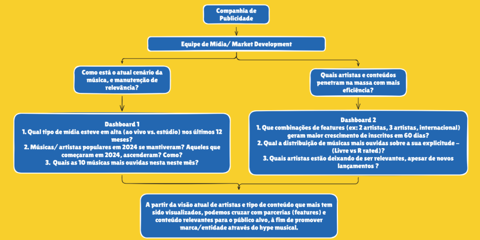

# Projeto Final - Fundamentos Engenharia de Dados  
**Tema:** Entretenimento - Agência de mídia - música

**Profº:** Wesley Lourenço Barbosa

# Integrantes - Grupo 7

- Fernando Luiz
- Igor Graseffi
- João Armandes
- Vitor Ribeiro
- Victor Lira

## Desafio do Projeto

Construção de um pipeline ELT completo, avaliando a qualidade dos dados desde a ingestão (`Raw`), passando pela transformação (`Silver`/`Gold`) até a visualização.

## Storytelling

Somos uma agência de mídia (marketing) especializada na melhoria do desempenho de artistas em promover as suas músicas nos streamings de músicas (exemplo: Spotify, Deezer, Tidal, YouTube, entre outros)

Principais questionamentos (problema de negócio):

- Qual o decay médio de playback por tipo de conteúdo  ao longo de 12 semanas?
- Músicas/ artistas populares em 2024 se mantiveram? Aqueles que começaram em 2024, ascenderam? Como?
- Que combinações de features geram maior crescimento de inscritos em 60 dias?
- Existe um limiar de inscritos a partir do qual conteúdo explícito deixa de ser eficaz?

## Diagrama Storytelling




## Diagrama arquitetura


## Diagrama base de dados


## Execução do Pipeline

### Pré-requisitos

- Docker e Docker Compose instalados
- Git

### Subir o ambiente

```bash
# 1. Clone o repositório
git clone <repo-url> && cd LAB_FundamentosDados_G7

# 2. Instalar .tar na pasta /backups
https://drive.google.com/file/d/1u0mfiLXVVsxLqtPZQQEDYUSoQxfiewB-/view?usp=sharing

# 3. Copie o arquivo de variáveis de ambiente
cp .env.example .env

# 4. Suba todos os serviços
docker compose up -d --build

# 5. Aguarde os containers ficarem healthy
docker compose ps
```

### Serviços disponíveis

| Serviço           | URL                        | Credenciais                |
| ----------------- | -------------------------- | -------------------------- |
| Airflow UI        | http://localhost:8080      | admin / admin              |
| Metabase          | http://localhost:3000      | admin@omdb.local / Admin123! |
| PostgreSQL        | localhost:5432             | postgres / postgres        |

### Executar o pipeline

1. Acesse o **Airflow** em http://localhost:8080
2. Ative a DAG `omdb_pipeline`
3. Dispare manualmente (Trigger DAG) ou aguarde a execução diária
4. Acompanhe os logs de cada tarefa:
   - `extract_load` → carrega litedb.tar para `raw`
   - `validate_raw` → Great Expectations valida a raw
   - `dbt_deps` → instala pacotes dbt
   - `dbt_run` → transforma raw → silver → gold
   - `dbt_test` → executa testes

### Conectar o Metabase ao schema gold

O Metabase é configurado automaticamente ao subir os containers (via `metabase-setup`).  
Caso precise reconfigurar manualmente:

1. Acesse http://localhost:3000
2. Configure a conexão PostgreSQL:
   - Host: `postgres`, Porta: `5432`, DB: `omdb`, User: `postgres`, Pass: `postgres`
3. Crie dashboards a partir das tabelas `gold.dim_artists`, `gold.dim_albums`, `gold.fact_tracks`
  
## Great Expectations

A qualidade dos dados neste projeto é garantida utilizando **Great Expectations (GE)**, integrado diretamente ao pipeline orquestrado pelo Airflow.

---

### Objetivo

As validações são aplicadas na camada **RAW**, logo após a ingestão dos dados, com o objetivo de:

- Detectar inconsistências o mais cedo possível  
- Evitar propagação de erros para as camadas analíticas (Silver e Gold)  
- Garantir confiabilidade nas análises finais no Metabase  

---

### Implementação

A validação é executada automaticamente pela DAG do Airflow na etapa:

```
validate_raw
```

Essa etapa chama o script:

```
scripts/validate_raw.py
```

O script utiliza Great Expectations para:

1. Conectar ao banco PostgreSQL  
2. Acessar a tabela `raw.artists`  
3. Definir regras de qualidade (expectations)  
4. Executar a validação  
5. Interromper o pipeline em caso de falha  

---

### Regras de Validação (Expectation Suite)

Atualmente, as seguintes validações são aplicadas à tabela `raw.artists`:

- **Tabela não vazia**  
  Garante que o processo de ingestão carregou dados corretamente  

```python
validator.expect_table_row_count_to_be_between(min_value=1)
```

- **Campo `id` obrigatório (NOT NULL)**  
  Evita registros inválidos sem identificação  

```python
validator.expect_column_values_to_not_be_null("id")
```

- **Campo `id` único**  
  Garante integridade e ausência de duplicidade  

```python
validator.expect_column_values_to_be_unique("id")
```

---

### Tratamento de Falhas

Caso alguma validação falhe:

- O Great Expectations retorna erro  
- A task `validate_raw` falha no Airflow  
- O pipeline é interrompido automaticamente  

Isso impede que dados inconsistentes avancem para as etapas de transformação (dbt).

---

### Integração com o Pipeline

Fluxo completo:

```
Extract → RAW → [Great Expectations] → dbt (Silver → Gold) → Metabase
```

---

### Escalabilidade

A arquitetura permite expansão simples das validações:

- Inclusão de novas tabelas como assets  
- Criação de novas regras de validação  
- Evolução para uso de checkpoints e Data Docs  

---

### Boas práticas aplicadas

- Validação na origem (data quality shift-left)  
- Separação entre ingestão, validação e transformação  
- Fail fast: pipeline interrompido em caso de erro  
- Estrutura preparada para evolução  

---

### Observação

Os arquivos de backup (`.tar`) não são versionados no repositório devido ao tamanho, sendo disponibilizados separadamente.

## DBT

A camada Gold foi desenvolvida com **dbt (data build tool)** para transformar dados brutos e tratados em modelos analíticos orientados ao negócio.  
Neste projeto, o dbt é responsável por consolidar a camada analítica que responde às perguntas centrais da agência de mídia musical, com foco em performance de artistas, decay de playback, impacto de features e efetividade de conteúdo explícito.

O pipeline já integra o dbt via Airflow nas etapas `dbt_deps`, `dbt_run` e `dbt_test`, garantindo execução automatizada das dependências, transformações e testes de qualidade. :contentReference[oaicite:1]{index=1}


### Objetivo da Camada Gold

A camada Gold tem como finalidade:

- disponibilizar tabelas analíticas prontas para consumo no Metabase;
- padronizar métricas de negócio;
- abstrair regras analíticas complexas em modelos reutilizáveis;
- aumentar a confiança dos dashboards por meio de testes e documentação.

As principais tabelas analíticas consumidas no BI são:

- `gold.dim_artists`
- `gold.dim_albums`
- `gold.fact_tracks`

---

### 1. Instalação / Configuração do DBT

- Instação do DBT (Postgres)

```
pip install dbt-postgres
```

- Inicialização do Projeto

```
dbt init dbt_labdb
```

- Configuração da conexão

→ arquivo >> `dbt\models\profiles.yml`


- Definição do Source (Camada Gold)

→ arquivo >> `dbt\models\marts\marts.yml`
→ schema  >> `dbt\schema.yml`

### 2. Visão Geral dos Dados

Na camada Gold, os dados deixam de representar somente entidades técnicas e passam a refletir uma visão de negócio voltada para marketing musical e performance em streaming.

Essa camada permite analisar, por exemplo:

- o decay médio de playback por tipo de conteúdo ao longo de 12 semanas;
- a permanência ou ascensão de artistas e músicas ao longo de 2024;
- o impacto de combinações de features no crescimento de inscritos;
- o comportamento do conteúdo explícito conforme a base de inscritos evolui. 

A proposta é transformar o modelo relacional da base em uma estrutura mais adequada para exploração analítica, com fatos e dimensões que simplificam o consumo por dashboards e relatórios executivos.

---

### 3. Criação de Data Marts

A camada Gold foi estruturada no conceito de **Data Marts**, organizando os dados por assunto de negócio.

#### `dbt\models\marts\gold.dim_artists`
Dimensão de artistas, utilizada para análises de relevância, popularidade, crescimento de inscritos e comparação entre artistas emergentes e consolidados.

#### `dbt\models\marts\gold.dim_albums`
Dimensão de álbuns, útil para analisar recorrência de lançamentos, relação entre projetos e impacto de álbuns na performance das faixas.

#### `dbt\models\marts\gold.fact_tracks`
Fato principal do projeto, reunindo métricas de desempenho das músicas, como volume de visualizações/playbacks, características do conteúdo e relacionamento com artistas e álbuns. Essa tabela é a base para responder às perguntas estratégicas do storytelling. :contentReference[oaicite:4]{index=4}

Essa modelagem permite separar:

- **dimensões**: entidades descritivas do negócio;
- **fatos**: eventos e métricas quantitativas;
- **regras analíticas**: lógica centralizada no dbt para reaproveitamento no Metabase.

---

### 4. Melhoria na Abstração

Um dos principais ganhos do uso do dbt neste projeto é a melhoria na abstração analítica.

Em vez de depender de consultas complexas diretamente no BI, as regras de negócio são centralizadas em modelos versionados e testáveis. Isso reduz duplicidade de lógica, melhora a rastreabilidade e facilita manutenção do pipeline.

Na prática, a camada Gold entrega:

- nomenclatura mais próxima do negócio;
- reaproveitamento de modelos analíticos;
- separação clara entre ingestão, tratamento e consumo;
- maior governança sobre métricas estratégicas.

Essa abordagem também facilita a evolução futura para métricas padronizadas, documentação automatizada e maior escalabilidade analítica.

---

   ### 5. Testes no DBT

Para aumentar a confiabilidade da camada Gold, foram definidos testes de integridade e qualidade diretamente nos modelos dbt.

Os testes aplicados seguem três pilares:

#### `not_null`
Garante que colunas críticas não contenham valores nulos.

Exemplos:
- `artist_id` em `dim_artists`
- `album_id` em `dim_albums`
- `track_id`, `artist_id` e `album_id` em `fact_tracks`

#### `unique`
Garante unicidade em chaves de negócio ou chaves substitutas.

Exemplos:
- `artist_id` em `dim_artists`
- `album_id` em `dim_albums`
- `track_id` em `fact_tracks`

#### `relationships`
Garante integridade referencial entre fato e dimensões.

Exemplos:
- `fact_tracks.artist_id` deve existir em `dim_artists.artist_id`
- `fact_tracks.album_id` deve existir em `dim_albums.album_id`

Documentação técnica gerada automaticamente

```
dbt docs generate
dbt docs serve 
```


## Dashboards Metabase

Dashboards em construção


## Papéis e Responsabilidades

| Integrante                   | Perfil Git      | Papel / Reponsabilidade Projeto |
|--------------------------|----------|----------|
| Fernando Luiz            | [@flg29-data](https://github.com/flg29-data)  | Documentação / Apresentação / Dashboards / Transformação Gold Layer (DBT) |
| Igor Graseffi            | [@Graseffi](https://github.com/Graseffi)   | Definição do Tema / Apresentação / Storytelling / Pipeline Dados / Dashboard / Qualidade de Dados (Great Expectations) |
| João Armandes             | Em construção  | Diagramas Arquitetura / Pipeline de Dados / Apresentação / Base de Dados / Dashboard / Visualização (Metabase) |
| Vitor Ribeiro            | [@TheLastAurora](https://github.com/TheLastAurora)  | Ingestão de Dados / Pipeline de Dados / Apresentação / Dashboard / Extração & Carga (Python EL) |
| Victor Lira            | [@VicLira](https://github.com/VicLira)  | Documentação / Apresentação / Vídeo Apresentação / Infraestrutura, Docker e Orquestração (Airflow) |


## Material de Apresentação

[Archives/Projeto Final G7 - Fundamentos Engenharia de Dados.pdf](https://github.com/TheLastAurora/LAB_FundamentosDados_G7/blob/15ac996eb4cb4fd6383103bc0bb523a09c656675/Archives/Projeto%20Final%20G7%20-%20Fundamentos%20Engenharia%20de%20Dados.pdf)


## Glossário

| Nome                   | Descrição |
|--------------------------|----------|
| PostgreSQL           | Sistema de gerenciamento de banco de dados relacional (SGBD) de código aberto, robusto e avançado, utilizado para armazenar, organizar e consultar dados com alta confiabilidade, suportando SQL padrão e recursos como transações, extensões e alta escalabilidade. |
| Apache Airflow          | Plataforma open source para orquestração de workflows, utilizada para agendar, monitorar e gerenciar pipelines de dados por meio de DAGs (grafos acíclicos dirigidos). |
| Great Expectations          | Framework open source para validação e qualidade de dados, que permite definir, testar e documentar regras (expectativas) para garantir a confiabilidade dos dados em pipelines e análises. |
| DBT | Ferramenta de transformação de dados que permite modelar, testar e documentar dados diretamente no banco, utilizando SQL e boas práticas de engenharia de dados em pipelines analíticos. |
| Metabase | Ferramenta open source de Business Intelligence (BI) que permite explorar dados, criar dashboards e gerar relatórios de forma simples e intuitiva, sem necessidade avançada de programação. |
| Docker | Plataforma que permite criar, empacotar e executar aplicações em containers, garantindo ambientes isolados, portáveis e consistentes entre desenvolvimento e produção. |
